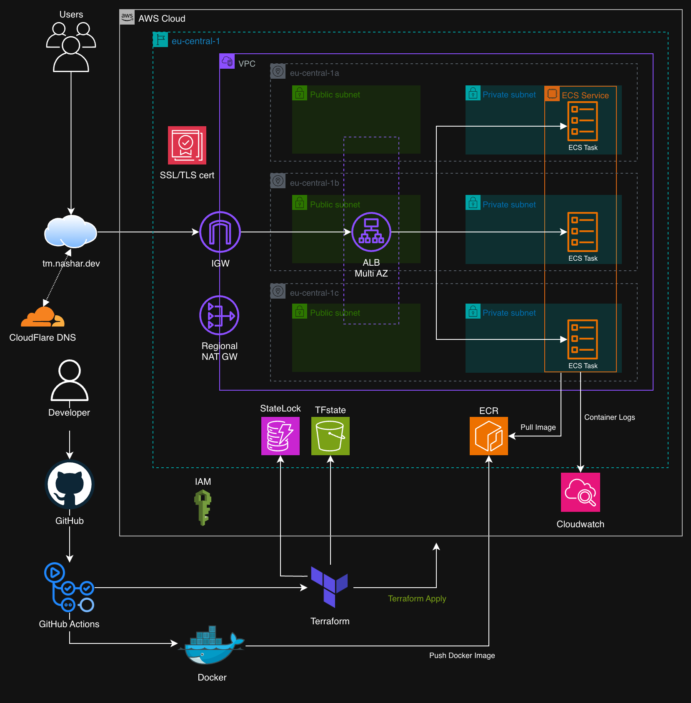
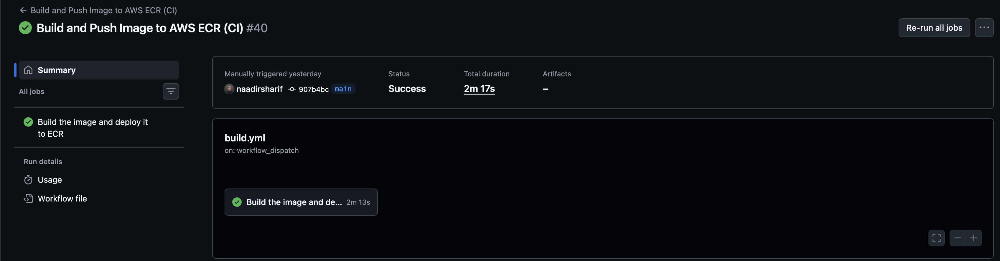

# Umami ECS Deployment Project 
Production-grade deployment of a self-hosted analytics platform using Docker, modular Terraform, AWS ECS Fargate, and GitHub Actions CI/CD.

---

## Why this project matters
The goal of this project is not just to run Umami, but to simulate how a production system is deployed in a real cloud environment, focusing on:

- **reproducible and modular** infrastructure as code
- **security-aware** architecture with production best practices
- **end-to-end infrastructure lifecycle management** (build, deploy, destroy)
- **automated build and deployment workflows**
  
---

## Architecture Diagram



---

## Delivery Highlights

- **~94% Docker image size reduction** (2.1GB → ~134MB) via multi-stage builds
- **reduced deployment time by ~92%** (~2h manual AWS setup → ~10min automated deployment)
- Terraform **quality & security checks** in CI/CD (**fmt + validate + Trivy +Checkov**)
- AWS authentication fully migrated to GitHub **OIDC**


---

## Design & Security Decisions

Rather than focusing only on functionality, this project contains production-style principles:

### Design
- **High Availability:** ECS service deployed across multiple Availability Zones for high availability
- **Traffic Management:** ALB handles routing, health checks, and distributes traffic across ECS tasks
- **Observability:** CloudWatch used for ECS task logging and monitoring

### Security
- **Private Compute:** ECS tasks run in private subnets (no public IPs) 
- **Controlled Entry Point:** Only the Application Load Balancer is publicly accessible
- **OIDC Authentication:** GitHub Actions uses OIDC (no static AWS credentials)
- **State Isolation:** Terraform state is stored in S3 with DynamoDB locking
- **Immutable Images:** Docker images are versioned using Git SHA tags only
- **CI/CD Security Gates:** Automated infra and image scanning (Checkov, Trivy) 
- **Manual Approval Gate:** Production deployments require reviewer approval before Terraform apply 

---

## Umami Demo


*Umami running on AWS ECS with HTTPS via the custom domain https://tm.nashar.dev.*

---

## About Umami

Umami is a lightweight, self-hosted analytics platform for tracking website traffic and user behavior without relying on third-party services.

- Tracks page views, visitors, and events  
- Privacy-focused alternative to traditional analytics tools  
- Simple, fast, and easy to self-host   

It provides essential analytics while keeping full control over your data.

---

## Deployment 




- **Bootstrap:** Creates core AWS resources for Terraform (**S3 state bucket, DynamoDB lock table, ECR repo, IAM OIDC roles**). One-time setup before any deployments.

- **CI (Build & Publish):** Builds the Docker image, tags it with the Git commit SHA, and pushes it to **Amazon ECR**.

- **CD (Infrastructure Deployment):** Automatically triggered **after CI success** via GitHub Actions. Runs **Terraform plan**, requires manual approval, **applies changes**, and **deploys ECS**.

- **Destroy (Infrastructure Cleanup):** Triggered manually via GitHub Actions, runs Terraform destroy to **remove all infrastructure** managed by the main stack.

---

## Deployment Guide
### [View full Guide](https://github.com/naadirsharif/umami-ecs/blob/main/deployment_guide.md)

---

## Local Testing

```bash 
# Build container
docker build -t umami:latest -f docker/Dockerfile .

# Run locally
docker run -p 3000:3000 \
  -e DATABASE_URL=<database-url> \
  umami:latest

# Access app via browser
http://localhost:3000
```

---

## Repository structure

```text
umami-ecs/
│ 
│── .github/
│   └── workflows/
│       ├── build.yml     # Build and Push Image to AWS ECR (CI)  
│       ├── deploy.yml    # Terraform Infra & ECS Deployment (CD)
│       └── destroy.yml   # Manual teardown: Terraform destroy (infra cleanup)
│
│
├── app/                    
│   ├── src/
│   ├── prsima/     
│   ├── package.json
│   └── ...  
│
├── docker/
│   ├── Dockerfile        # Multi-stage build (optimized image)
│   └── .dockerignore
│       
├── infra/
│   ├── bootstrap/        # One-time setup: S3 state, DynamoDB lock, ECR, OIDC
│   │   ├── ecr.tf
│   │   ├── s3.tf
│   │   ├── oidc.tf
│   │   └── ...
│   │
│   ├── main.tf           # infrastructure entry point
│   ├── variables.tf
│   ├── outputs.tf
│   ├── terraform.tfvars
│   └── modules/          # Modular infrastructure (VPC, ECS, ALB, DNS, ACM)
│       ├── vpc
│       ├── alb
│       ├── ecs
│       ├── dns
│       └── acm             
│   
├── deployment_guide.md   # Full deployment & teardown guide
└── README.md
```


