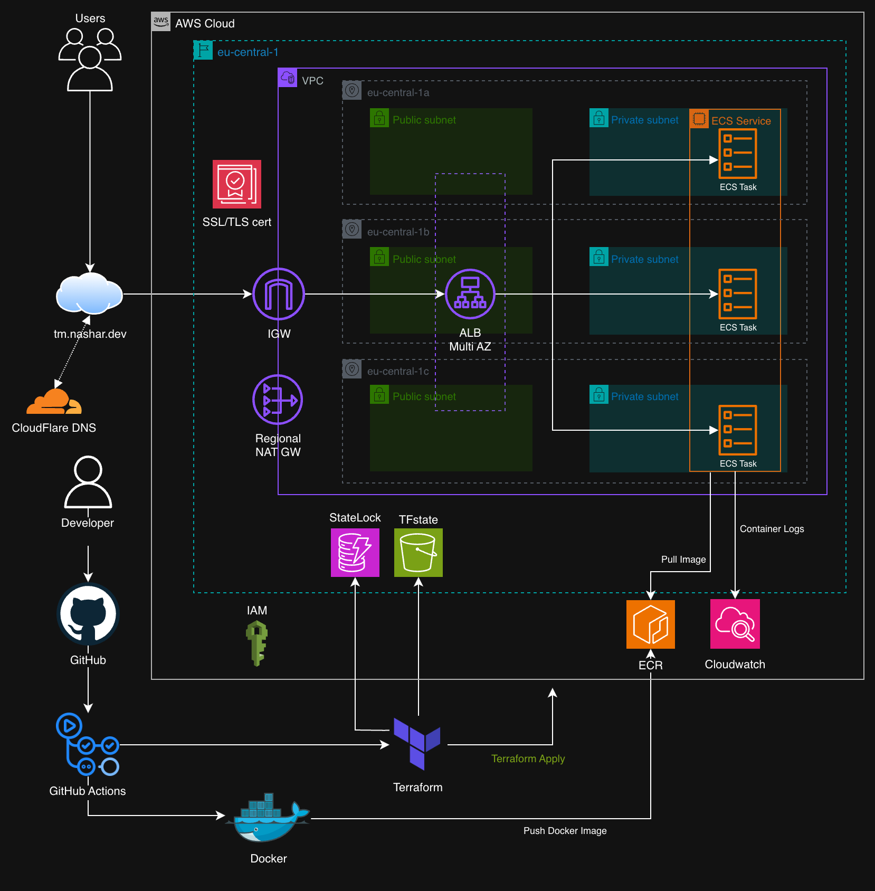
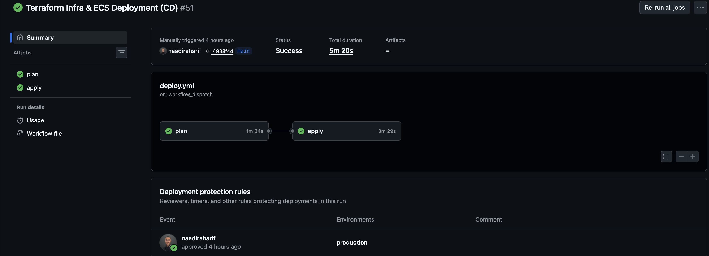

# Umami ECS Deployment Project 
Production-grade deployment of a self-hosted analytics platform using modular Terraform, AWS ECS Fargate, and GitHub Actions CI/CD.

---

## Why this project matters
The goal of this project is not just to run Umami, but to simulate how a production system is deployed in a real cloud environment.

- reproducible infrastructure as code
- secure-by-default architecture
- fully automated deployments
- separation of CI (build) and CD (infrastructure)
  
---

## Architecture Diagram



---

## Delivery Highlights

- Docker image size: **2.1GB → ~134MB (~94% reduction)** via multi-stage builds
- ~2h manual AWS setup → ~10min automated deployment (reduced deployment time by **~92%**)
- Terraform quality gates via **fmt + validate** (CI/CD pipeline checks)
- AWS authentication fully migrated to GitHub **OIDC**

---

## Design & Security Decisions

Rather than focusing only on functionality, this project enforces production-style constraints:

- **Private Compute:** ECS tasks run in private subnets (no public IPs) 
- **Controlled Entry Point:** Only the Application Load Balancer is publicly accessible
- **OIDC Authentication:** GitHub Actions uses OIDC (no static AWS credentials)
- **State Isolation:** Terraform state is stored in S3 with DynamoDB locking
- **Immutable Images:** Docker images are versioned using Git SHA tags only
- **Protected Deployments:** Production changes require manual approval via GitHub Environments
- **High Availability:** ECS service deployed across multiple Availability Zones
- **Observability:** CloudWatch used for ECS task logging and monitoring

---

## Umami Demo


***Umami running on AWS ECS with HTTPS via the custom domain https://tm.nashar.dev.***

---

## About Umami

Umami is a lightweight, self-hosted analytics platform for tracking website traffic and user behavior without relying on third-party services.

- Tracks page views, visitors, and events  
- Privacy-focused alternative to traditional analytics tools  
- Simple, fast, and easy to self-host   

It provides essential analytics while keeping full control over your data.

---

## Deployment 



- **Bootstrap:** Creates core AWS resources for Terraform (**S3 state bucket, DynamoDB lock table, ECR repo, IAM OIDC roles**). One-time setup before any deployments.
- **CI (Build & Publish):** Builds the Docker image, tags it with the Git commit SHA, and pushes it to **Amazon ECR**. No infrastructure changes.
- **CD (Infrastructure Deployment):** Triggered manually via GitHub Actions, runs **Terraform plan**, requires approval, **applies changes**, and deploys **ECS**.

---

## Deployment Guide
### [View full Guide](https://github.com/naadirsharif/umami-ecs/blob/main/deployment_guide.md)

---

## Local Testing

```bash 
# Build container
docker build -t umami:latest -f docker/Dockerfile .

# Run locally
docker run -p 3000:3000 \
  -e DATABASE_URL=<database-url> \
  umami:latest

# Access app via browser
http://localhost:3000
```

---

## Repository structure

```text
umami-ecs/
│ 
│── .github/
│   └── workflows/
│       ├── build.yml       
│       └── deploy.yml   
│
├── app/                    
│   ├── src/
│   ├── prsima/     
│   ├── package.json
│   └── ...  
│
├── docker/
│   ├── Dockerfile
│   └── .dockerignore
│       
├── infra/
│   ├── bootstrap/
│   │   ├── ecr.tf
│   │   ├── s3.tf
│   │   ├── oidc.tf
│   │   └── ...
│   │
│   ├── main.tf
│   ├── variables.tf
│   ├── outputs.tf
│   ├── terraform.tfvars
│   └── modules/
│       ├── vpc
│       ├── alb
│       ├── ecs
│       ├── dns
│       └── acm             
│   
├── deployment_guide.md
└── README.md
```


